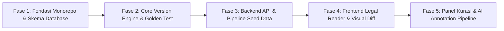

# CETAK BIRU EKSEKUSI & TESTING BERTINGKAT (LEXVERA / JURISLAB)
**Sistem Konsolidasi, Rekonstruksi Norma, dan Version Control Perundang-Undangan Indonesia**

---

## 1. PRINSIP EKSEKUSI: *ISOLASI INTI DULU, ANTARMUKA KEMUDIAN*

Agar eksekusi cepat, terukur, dan tidak rentan perombakan besar di tengah jalan:
1. **Pemisahan Logika Bisnis dari Tampilan**: Mesin konsolidasi hukum (*Version Control Engine*) dibangun sebagai modul TypeScript murni tanpa ketergantungan framework web.
2. **Determinisme & Zero-Loss**: Hasil rekonstruksi naskah pada titik tanggal tertentu diverifikasi menggunakan *Golden Test* (pencocokan karakter 100% dengan naskah Lembaran Negara resmi).
3. **Piramida Pengujian Ketat**: Setiap perubahan kode wajib melewati 4 lapis verifikasi otomatis sebelum masuk tahap integrasi berikutnya.
4. **Perbaikan Sembari Berkembang (*Continuous Calibration*)**: Fitur-fitur sekunder (AI Chat, Parser PDF otomatis, scraper JDIHN) dikembangkan secara plug-and-play di atas fondasi skema database yang sudah terkunci.

---

## 2. STRUKTUR WORKSPACE & DIREKTORI PROYEK

Struktur monorepo pnpm/Turborepo di `E:\Platfrom_Hukum`:

```
E:\Platfrom_Hukum/
├── apps/
│   ├── web/                        # Next.js 15 (App Router, Tailwind CSS, Lucide)
│   │   ├── app/
│   │   │   ├── (reader)/peraturan/[slug]/page.tsx      # Tampilan Naskah Konsolidasi
│   │   │   ├── (reader)/bandingkan/page.tsx            # Side-by-Side Diff Viewer
│   │   │   ├── (curator)/validasi/page.tsx             # Panel Kurasi Human-in-the-Loop
│   │   │   └── api/                                    # Server Actions / BFF
│   │   ├── components/
│   │   │   ├── diff/               # Komponen visualisasi penandaan perubahan
│   │   │   ├── reader/             # Hirarki navigasi bab, pasal, ayat
│   │   │   └── annotations/        # Tag putusan MK / uji materi
│   │   └── package.json
│   │
│   └── api/                        # NestJS / Fastify Backend Service
│       ├── src/
│       │   ├── modules/
│       │   │   ├── instruments/    # CRUD metadata peraturan
│       │   │   ├── provisions/     # Manajemen hierarki pasal/ayat
│       │   │   ├── engine/         # Runner rekonstruksi konsolidasi
│       │   │   └── annotations/    # Integrasi amar putusan MK
│       │   └── main.ts
│       └── package.json
│
├── packages/
│   ├── legal-engine/               # Core Engine Murni (Nol dependensi web/DB)
│   │   ├── src/
│   │   │   ├── operations/         # ADD, REPLACE, REPEAL, PARTIAL_REPEAL
│   │   │   ├── reconstructor.ts    # Time-travel point-in-time compiler
│   │   │   └── diff-generator.ts   # Komputasi selisih kata/frasa
│   │   ├── tests/
│   │   │   ├── unit/               # Tes logika operasi atomik
│   │   │   └── golden/             # Dataset Golden Test (UU ITE 2008-2016-2024)
│   │   └── package.json
│   │
│   ├── database/                   # Skema & Klien Prisma
│   │   ├── prisma/
│   │   │   ├── schema.prisma       # Skema 4-lapisan data
│   │   │   └── migrations/         # Migrasi historis PostgreSQL
│   │   ├── seed/                   # Seeder data uji peraturan percontohan
│   │   └── src/index.ts            # Ekspor instance PrismaClient
│   │
│   └── types/                      # Shared DTO & Definisi Tipe Yuridis
│       └── src/
│           ├── legal-ast.ts        # Abstract Syntax Tree hierarki undang-undang
│           └── operations.ts       # Definisi payload perubahan norma
│
├── docker-compose.yml              # PostgreSQL 16 + pgvector + MinIO
├── pnpm-workspace.yaml
├── turbo.json
└── package.json
```

---

## 3. RENCANA TAHAPAN EKSEKUSI (5 FASE TERUKUR)



### Fase 1: Inisialisasi Monorepo & Skema 4-Lapisan Database (Target: Hari 1 - 3)
- **Tujuan**: Membangun fondasi infrastruktur lokal yang stabil dan mendefinisikan kontrak data yang tidak berubah (*immutable schema*).
- **Aktivitas**:
  1. Inisialisasi workspace pnpm & Turborepo di `E:\Platfrom_Hukum`.
  2. Setup `docker-compose.yml` untuk PostgreSQL 16 dengan ekstensi `pgvector`.
  3. Mengimplementasikan `schema.prisma` mencakup 4 lapis:
     - Lapis 1: `source_documents` (PDF & Hash SHA-256).
     - Lapis 2: `legal_instruments` & `provisions` (Node stabil hierarki norma).
     - Lapis 3: `change_sets` & `change_operations` (Operasi amandemen).
     - Lapis 4: `publications` & `publication_items` (Snapshot konsolidasi).
  4. Menjalankan migrasi pertama dan menyiapkan Prisma Client generator.
- **Kriteria Selesai (DoD)**:
  - `pnpm db:migrate` berhasil dijalankan tanpa error.
  - Skema tervalidasi dengan relasi kunci asing yang ketat.

---

### Fase 2: Pembangunan Core Version Engine & Golden Test Suite (Target: Hari 4 - 7)
- **Tujuan**: Membangun mesin rekonstruksi naskah perundang-undangan deterministik murni di `packages/legal-engine`.
- **Aktivitas**:
  1. Implementasi operasi hukum atomik:
     - `ADD_PROVISION` (Sisip pasal baru, misal: Pasal 27A, 45A).
     - `REPLACE_PROVISION` (Ubah redaksional pasal/ayat secara utuh).
     - `REPEAL_PROVISION` (Hapus/cabut pasal atau ayat).
     - `PARTIAL_REPEAL` (Hapus kata/frasa tertentu akibat Putusan MK).
  2. Implementasi compiler rekonsiliasi: menerima AST naskah dasar + daftar operasi amandemen $\rightarrow$ menghasilkan naskah konsolidasi snapshot pada tanggal yang diminta.
  3. Membangun **Golden Test Suite**:
     - Pilot: **UU ITE Keluarga Lengkap** (UU No. 11 Tahun 2008 $\rightarrow$ UU No. 19 Tahun 2016 $\rightarrow$ UU No. 1 Tahun 2024).
- **Kriteria Selesai (DoD)**:
  - 100% unit tests lolos.
  - Golden Test membuktikan teks konsolidasi hasil komputasi identik karakter-per-karakter dengan naskah Lembaran Negara resmi.

---

### Fase 3: Backend API & Data Seeder Otomatis (Target: Hari 8 - 11)
- **Tujuan**: Membungkus engine dan database menjadi layanan API REST/GraphQL yang aman, cepat, dan siap dikonsumsi klien.
- **Aktivitas**:
  1. Setup layanan backend `apps/api`:
     - Endpoint `GET /instruments`: Daftar peraturan per kategori & tahun.
     - Endpoint `GET /instruments/:id/tree`: Struktur hierarki pasal lengkap.
     - Endpoint `GET /instruments/:id/snapshot?date=YYYY-MM-DD`: Mengambil naskah konsolidasi pada tanggal tertentu.
     - Endpoint `GET /provisions/:id/diff?from=v1&to=v2`: Komparasi granular per pasal.
  2. Implementasi Seeder Data Historis:
     - Script ingestion otomatis untuk memasukkan naskah UU ITE 2008, UU ITE 2016, dan UU ITE 2024 ke dalam tabel database.
- **Kriteria Selesai (DoD)**:
  - API endpoint mengembalikan respon JSON valid dengan latensi <50ms untuk penarikan hierarki naskah konsolidasi.
  - Seeder mengisi database dengan data pilot yang terverifikasi utuh.

---

### Fase 4: Frontend Legal Reader & Side-by-Side Diff Viewer (Target: Hari 12 - 16)
- **Tujuan**: Membangun antarmuka pembaca undang-undang profesional ramah akademisi dengan kemampuan perbandingan ala Git.
- **Aktivitas**:
  1. Setup aplikasi `apps/web` (Next.js 15, Tailwind CSS).
  2. Halaman Legal Reader (`/peraturan/[slug]`):
     - Sidebar daftar isi adaptif (Bab $\rightarrow$ Bagian $\rightarrow$ Paragraf $\rightarrow$ Pasal).
     - Area baca naskah bersih dengan tipografi hukum standar (Times New Roman / Inter serif formal).
     - Badge status pasal (*"Berlaku"*, *"Diubah oleh UU X"*, *"Dibatalkan MK"*).
  3. Komparator Visual (*Side-by-Side Diff Viewer* di `/bandingkan`):
     - Kolom Kiri: Naskah lama (penanda merah untuk teks yang dihapus).
     - Kolom Kanan: Naskah baru (penanda hijau untuk teks yang ditambah).
     - Tautan dasar hukum amandemen.
  4. Fitur Ekspor Naskah Konsolidasi (PDF formal bersih).
- **Kriteria Selesai (DoD)**:
  - Reader interaktif dan responsif, perpindahan antar pasal mulus.
  - Diff viewer akurat menampilkan penambahan dan penghapusan kata pada UU ITE.

---

### Fase 5: Panel Kurasi & Integrasi Anotasi Putusan MK (Target: Hari 17 - 21)
- **Tujuan**: Menyediakan dashboard kurasi naskah bagi dosen/peneliti hukum (*Human-in-the-Loop*) dan memasang penanda putusan Mahkamah Konstitusi.
- **Aktivitas**:
  1. Panel Kurasi (`/curator/validasi`):
     - Meninjau draft operasi amandemen sebelum diubah menjadi status `PUBLISHED`.
     - Review log dan audit trail persetujuan.
  2. Integrasi Anotasi Putusan MK:
     - Relasi tabel anotasi putusan (Nomor Perkara MK, Amar Putusan, Tanggal Putusan).
     - Penanda visual langsung pada pasal yang diuji materi di MK (contoh: Pasal 27 ayat 3 UU ITE pasca putusan MK No. 50/PUU-VI/2008).
- **Kriteria Selesai (DoD)**:
  - Kurator dapat memvalidasi dan mempublikasikan revisi naskah secara mandiri.
  - Pasal-pasal kontroversial memiliki badge anotasi MK yang dapat diklik untuk membaca ringkasan pertimbangan hukum hakim.

---

## 4. METODOLOGI PENGUJIAN & VERIFIKASI BERTINGKAT (*MULTI-TIER TESTING*)

Untuk menjamin tidak terjadi regresi selama pengembangan berkelanjutan:

| Tingkat | Nama Pengujian | Cakupan & Alat | Lokasi Tes |
| :--- | :--- | :--- | :--- |
| **L1** | **Unit Testing** | Logika atomik: pemotongan string norma, fungsi add/replace/repeal, validasi format nomor pasal. (*Vitest / Jest*) | `packages/legal-engine/tests/unit/` |
| **L2** | **Golden Testing** | Pengujian naskah konsolidasi utuh. Input: Naskah A + Amandemen B $\rightarrow$ Output harus 100% cocok dengan naskah resmi Kemenkumham/BPHN. | `packages/legal-engine/tests/golden/` |
| **L3** | **Integration Testing** | Transaksi database Prisma, integritas foreign key, migrasi, dan kontrak response API NestJS. (*Supertest / Testcontainers*) | `apps/api/test/` |
| **L4** | **E2E & Visual Testing** | Render halaman reader, navigasi hierarki pasal, rendering warna diff (merah/hijau), ekspor PDF. (*Playwright*) | `apps/web/tests/e2e/` |

---

## 5. RITME KERJA: "PERBAIKAN SEMBARI BERKEMBANG" (*CONTINUOUS CALIBRATION*)

1. **Commit Berbasis Fitur Vertikal**: Jangan membuat seluruh database lalu seluruh backend baru seluruh frontend. Kerjakan per irisan fitur vertikal:
   - *Irisan 1*: Naskah Asli UU ITE 2008 (DB $\rightarrow$ Engine $\rightarrow$ API $\rightarrow$ Tampilan Reader).
   - *Irisan 2*: Amandemen Pertama 2016 (Change Set $\rightarrow$ Konsolidasi Engine $\rightarrow$ Side-by-Side Diff).
   - *Irisan 3*: Amandemen Kedua 2024 (Operasi Kompleks $\rightarrow$ Golden Test 100% Lulus).
2. **Karantina Bug via Golden Test**: Jika ditemukan salah kutip kata atau tanda baca yang hilang pada hasil konsolidasi:
   - Tuliskan kasus tersebut ke dalam file pengujian Golden Test sebelum memperbaiki kode.
   - Perbaiki parser/engine hingga test tersebut hijau.
   - Hasil ini menjamin bug serupa tidak akan pernah muncul kembali.
3. **Pemberian Umpan Balik Cepat**: Setiap sprint kecil (2-3 hari) menghasilkan produk yang bisa dibuka langsung di browser dan diuji oleh akademisi hukum.
